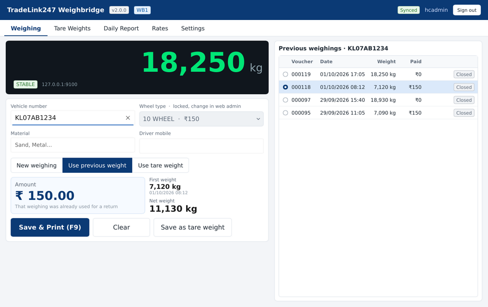

# TradeLink247 Weighbridge (Slint)

The weighbridge screen for site PCs, written in Rust with [Slint](https://slint.dev). It replaces
the Qt weighbridge application. It reads the indicator, saves each weighing on the PC first (so
it works offline), prints the voucher, and uploads to the TradeLink247 server.

It keeps the same rules, server endpoints and local database as the Electron build it replaced
(removed; it never went to production). Version numbers start at 2.0.0, so the updater never goes
back to an Electron 1.x installer.



## What it does

| Tab | |
|---|---|
| Weighing | Live weight, vehicle number with suggestions, wheel type (locked when the web admin set it), material, driver mobile. New weighing, use previous weight (return trip), or use a saved tare weight. **F9** or **Ctrl+S** saves and prints. |
| Tare Weights | Save an empty vehicle's weight, list and search saved tares. Every tare on the server (all branches, including ones imported from the Qt screen) is downloaded at setup and each time the app starts. |
| Daily Report | Weighings between two times, totals, reprint, export CSV. |
| Rates | Rate per wheel type. Admins can change them when the web admin allows it (Weighbridge PCs). |
| Settings | Indicator, Printing, Weighing, Camera, Branch & data. Admin only, and locked until the web admin opens them for this PC. |

- **Indicator**: serial (COM port) or network (TCP/IP), continuous or polled output, presets plus
  a raw data monitor. The "Current sites (STX + digits + CR)" preset reads what the Qt screen reads.
- **Printing**: A5, 80 mm receipt (both through the Windows printer driver) or **dot-matrix**
  (plain text, sent raw with ESC/P, 40 or 80 characters a line, form feed after each voucher).
  A PDF copy of every voucher is kept in Documents\TradeLink247 Weighbridge\Vouchers unless turned off.
- **Camera**: a USB/built-in camera or an IP camera's snapshot address (Hikvision, Dahua). A photo
  is taken on save, kept on the PC, and optionally uploaded and printed.
- **Screen size**: opens maximized and fits screens from 1024x768 up. Under 1280x800 it switches
  to a compact layout (smaller controls, less padding) so every tab fits without scrolling sideways.
- **Vehicles on the bridge**: every visit (empty bridge, vehicle, empty bridge again) is sent to
  the server with a photo, voucher or not. The web admin's Weight-Count compares them with the
  vouchers saved to show vehicles weighed without a voucher.
- **Updates**: checks the server every 30 minutes (click the version in the header to check now),
  downloads in the background and installs when the bridge is free and no one is in the middle
  of a weighing, or on "Restart to update".

## Windows service (3.0+)

The installer puts the app on the PC as two parts, both the same exe:

- **The service** ("TradeLink247 Weighbridge" in Services, `--service`). It starts when Windows
  starts, before anyone logs in, and Windows starts it again if it stops. It holds the indicator
  and the camera, records every vehicle on the bridge, uploads to the server and installs
  updates. Operators can't close it.
- **The screen**, started at every logon (and from the desktop shortcut). It shows the weight and
  camera from the service and saves and prints weighings. Closing it doesn't stop the service.

They talk over 127.0.0.1:47247 (`WB_IPC_PORT` to change), with a key in the data folder.
Updates install from the service without asking for an administrator; open screens close and
come back on the new version.

## Data

Everything lives in `%ProgramData%\TradeLink247 Weighbridge` (`weighbridge.db`, `server.json`,
`logs`, `photos`), shared by the service and every Windows user of the PC. Uninstalling never
deletes it. On its first start the service copies a 2.x install's data (per user, in
`%APPDATA%\TradeLink247 Weighbridge`) into it. Set `WB_USERDATA` to use another folder.

## Moving a site from the Qt screen

1. Run `TradeLink247-Weighbridge-Setup-<version>.exe` on the weighbridge PC as an administrator
   (once; later updates install themselves).
2. Enter the server address, sign in as an admin and choose the branch. Voucher numbers carry on
   from the branch's last voucher on the server, and recent weighings are copied to the PC so
   return trips are recognised.
3. Ask for Settings to be opened in the web admin (Weighbridge PCs), then under Settings set the
   indicator (usually the "Current sites" preset and the same COM port the Qt screen used),
   printer and paper, and the camera if there is one. Close the Qt screen first: only one program
   can hold the COM port.
4. Save. Settings lock again after a restart, and a copy is kept on the server.

## Build

```sh
cargo test                # parser, charging rule, store, sync, settings lock (103 tests)
cargo run                 # development build; no auto-update
cargo build --release     # Windows: target\release\weighbridge-slint.exe
makensis -DVERSION=3.0.0 -DEXE=..\target\release\weighbridge-slint.exe installer\installer.nsi
```

Linux needs `libudev-dev`, `libxkbcommon-dev` and `libfontconfig1-dev`; printing and the USB
camera work on Windows only. CI (`.github/workflows/weighbridge-slint.yml`) runs the tests and
builds the installer; on main it also publishes it to the server (`latest.txt` in
`weighbridge.app.dir`), so /download serves it and site PCs update to it. To release, bump
`version` in `Cargo.toml` and merge.

Installer switches: `/S` silent, `/RUN` open the screen afterwards. A PC on 2.x updates to 3.0
from the app, but Windows asks for an administrator to approve it (2.0.6+; older 2.x need the
installer run by hand).

Development without Windows: `cargo run -- --service` runs the service in the foreground, and
`WB_SCREEN=1 cargo run` opens a screen that connects to it (use the same `WB_USERDATA` for both).

Environment variables: `WB_USERDATA` (data folder), `WB_NO_UPDATES` (no update checks),
`WB_SCREEN` (be a screen of the service), `WB_SERVICE_CONSOLE` (Windows: `--service` outside the
service manager), `WB_IPC_PORT`,
`SLINT_BACKEND` (renderer; the default is the software renderer, which works on any PC,
including over Remote Desktop).
